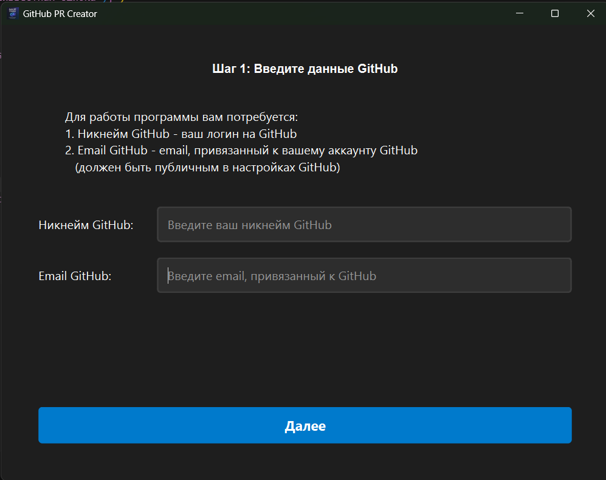
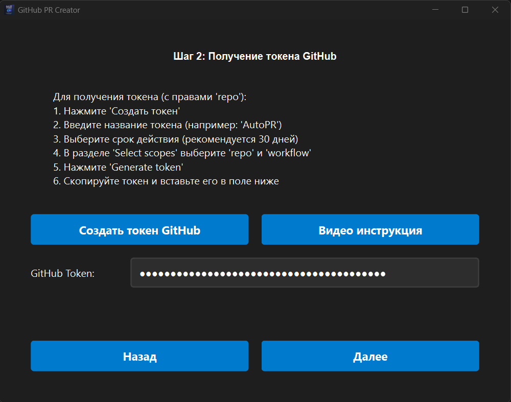
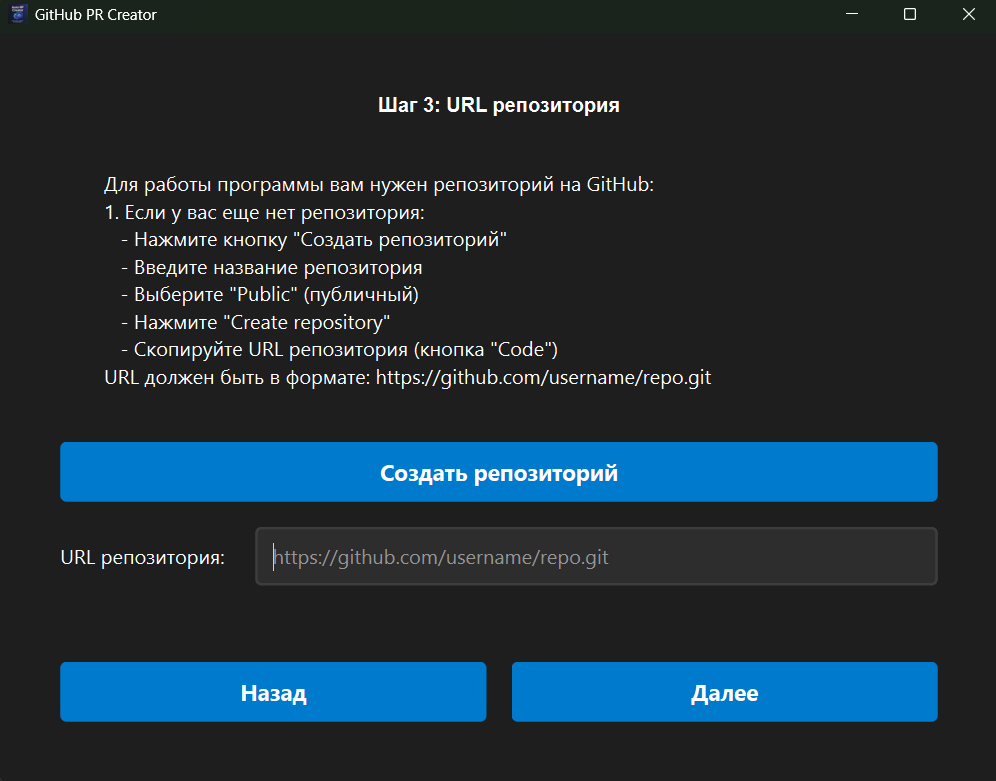
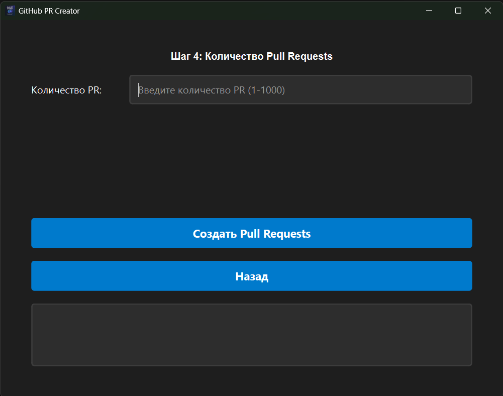

# Документация проекта GitHub PR Creator

## 1. Обзор проекта

Проект **GitHub PR Creator** - это десктопное приложение, разработанное с использованием PyQt6, предназначенное для автоматического создания и мерджа Pull Requests в указанном GitHub репозитории. Его основная цель — генерировать "вклады" в статистику GitHub пользователя, создавая имитацию реальной активности разработки. Приложение создает временные Git-репозитории, имитирует изменения в файлах (добавляя новые файлы в различных директориях - `src`, `tests`, `docs`, `requirements.txt`), коммитит их, пушит в новые ветки, создает Pull Requests через GitHub API и затем автоматически их мержит.

## 2. Структура проекта

```
.
├── auto_pr_creator.py
├── Auto_RP_Creator.ico
├── pr_creator_data.json
├── screen1.png
├── screen2.png
├── screen3.png
├── screen4.png
└── receiving_a_token.mp4
```

## 3. Описание файлов и папок

### `auto_pr_creator.py`

*   **Назначение:** Это основной исполняемый файл приложения, содержащий всю логику GUI, взаимодействия с Git и GitHub API.
*   **Основные классы/функции/переменные:**
    *   **`PRWorker(QThread)`:** Класс, наследуемый от `QThread`, отвечающий за выполнение всех долгосрочных и блокирующих операций (Git-команды, запросы к GitHub API) в отдельном потоке, чтобы основной поток GUI оставался отзывчивым.
        *   `__init__(self, username, email, pr_count, token, repo_url)`: Конструктор, инициализирующий данные для работы.
        *   `run_git_command(self, command, check=True)`: Выполняет Git-команды с помощью `subprocess`. Обрабатывает ошибки и отправляет сигналы об ошибках в основной поток.
        *   `check_git_status(self)`: Проверяет статус Git репозитория.
        *   `initialize_repository(self)`: Инициализирует временный Git репозиторий, настраивает `user.name` и `user.email`, создает `README.md`, делает первый коммит, добавляет `origin` с токеном и пушит `main` ветку.
        *   `cleanup(self)`: Метод для безопасного удаления временной директории, включая специфическую обработку заблокированных Git-файлов в `.git` директории на Windows.
        *   `run(self)`: Главный метод потока, где происходит весь цикл создания PR:
            *   Инициализация репозитория.
            *   Цикл по количеству PR:
                *   Случайная задержка перед каждым PR.
                *   Создание новой ветки.
                *   Генерация "реалистичных" изменений в файлах (`.py`, `.md`, `requirements.txt`) в разных директориях (`src`, `tests`, `docs`).
                *   Добавление и коммит изменений.
                *   Пуш ветки в удаленный репозиторий.
                *   Создание Pull Request через GitHub API.
                *   Случайная задержка перед мерджем.
                *   Мердж Pull Request через GitHub API.
                *   Возврат на `main` ветку и обновление.
    *   **`MainWindow(QMainWindow)`:** Главный класс окна приложения, управляющий пользовательским интерфейсом.
        *   `__init__(self)`: Конструктор, настраивающий окно, стили, иконку, `QStackedWidget` для пошагового интерфейса.
        *   `create_input_field(self, target_layout, label_text, placeholder_text="")`: Вспомогательная функция для создания полей ввода.
        *   `create_prs(self)`: Слот, вызываемый при нажатии кнопки "Создать PR". Валидирует введенные данные, сохраняет их, создает и запускает экземпляр `PRWorker`.
        *   `update_progress(self, value)`: Слот для обновления прогресс-бара.
        *   `handle_finished(self, success, message)`: Слот, вызываемый по завершении `PRWorker`. Отображает сообщение об успехе или ошибке.
        *   `save_data(self, username, email, token, repo_url)`: Сохраняет введенные пользователем данные в `pr_creator_data.json`.
        *   `load_saved_data(self)`: Загружает ранее сохраненные данные из `pr_creator_data.json` для предзаполнения полей.
*   **Взаимодействие с другими файлами:**
    *   Читает/пишет `pr_creator_data.json` для сохранения/загрузки настроек.
    *   Использует `Auto_RP_Creator.ico` как иконку приложения.
    *   Создает временные файлы и директории (например, `src`, `tests`, `docs`, `requirements.txt`) внутри временного Git репозитория.
*   **Принцип работы:** Пользователь проходит пошаговый интерфейс, вводя свои данные GitHub, токен и URL репозитория. После запуска, `PRWorker` в фоновом режиме выполняет последовательность Git-операций (инициализация, коммиты, пуши) и запросов к GitHub API (создание и мердж PR). Прогресс и статус отображаются в GUI. По завершении или при ошибке, приложение сообщает результат.

### `Auto_RP_Creator.ico`

*   **Назначение:** Файл иконки приложения. Используется классом `MainWindow` для установки иконки окна, которая отображается в заголовке, панели задач и при переключении окон.

### `pr_creator_data.json`

*   **Назначение:** Файл для хранения последних введенных пользователем данных (имя пользователя, email, токен, URL репозитория). Это позволяет сохранить настройки между запусками приложения и не вводить их каждый раз заново.
*   **Структура:** Простой JSON-объект, например:
    ```json
    {
        "username": "ваш_юзернейм",
        "email": "ваш_email",
        "token": "ваш_токен",
        "repo_url": "https://github.com/ваш_юзернейм/ваш_репозиторий.git"
    }
    ```
*   **Взаимодействие с другими файлами:** Читается и записывается методом `save_data` и `load_saved_data` класса `MainWindow` в `auto_pr_creator.py`.

## 4. Общая архитектура проекта

Проект построен на основе **клиент-серверной архитектуры** с точки зрения взаимодействия с GitHub (где GitHub API является "сервером"). Однако, в контексте самого приложения, это **многопоточное десктопное приложение** с четким разделением логики:

*   **Пользовательский интерфейс (GUI):** Реализован на PyQt6 (`MainWindow`). Он предоставляет многостраничный (wizard-like) интерфейс (`QStackedWidget`) для ввода данных и отображения статуса/прогресса.
*   **Бизнес-логика и выполнение задач:** Вынесена в отдельный поток (`PRWorker`), наследующий от `QThread`. Это критично для предотвращения зависания GUI во время выполнения долгих Git-операций и сетевых запросов.
*   **Взаимодействие с Git:** Осуществляется через вызов внешних команд Git с помощью модуля `subprocess`.
*   **Взаимодействие с GitHub API:** Используется библиотека `requests` для HTTP-запросов к API GitHub для создания и мерджа Pull Requests.
*   **Хранение данных:** Введенные пользователем данные сохраняются в локальном JSON-файле (`pr_creator_data.json`).
*   **Изолированная среда:** Все Git-операции выполняются во временной директории (`tempfile`), что гарантирует чистоту и не влияет на существующие Git-репозитории пользователя.

## 5. Сторонние библиотеки и фреймворки

*   **PyQt6:**
    *   **Назначение:** Основной фреймворк для создания графического пользовательского интерфейса (GUI). Предоставляет виджеты (кнопки, поля ввода, прогресс-бары и т.д.) и механизмы обработки событий.
*   **`requests`:**
    *   **Назначение:** HTTP-клиент для Python. Используется для отправки HTTP-запросов к GitHub API (например, для создания и мерджа Pull Requests).
*   **Стандартные библиотеки Python:**
    *   **`sys`:** Доступ к системным параметрам и функциям (например, для завершения приложения).
    *   **`os`:** Взаимодействие с операционной системой (работа с путями, создание директорий, изменение текущей директории).
    *   **`json`:** Работа с данными в формате JSON (для сохранения/загрузки настроек).
    *   **`subprocess`:** Запуск внешних процессов (например, выполнение команд Git).
    *   **`webbrowser`:** Открытие веб-страниц в браузере по умолчанию (например, для получения токена или создания репозитория).
    *   **`shutil`:** Высокоуровневые операции с файлами и директориями (например, для удаления деревьев директорий).
    *   **`time`:** Для введения задержек (`time.sleep`).
    *   **`tempfile`:** Создание временных файлов и директорий, что критично для изолированного Git-окружения.
    *   **`random`:** Генерация случайных чисел (для случайных задержек и имитации различных изменений).
    *   **`datetime`:** Работа с датами и временем (может использоваться для создания уникальных имен веток/коммитов).


## 6. Скриншоты приложения

### Экран 1: Введите данные GitHub



На этом экране пользователь вводит свои учетные данные GitHub: имя пользователя (username) и адрес электронной почты (email), которые будут использоваться для привязки коммитов и PR к его профилю.

### Экран 2: Получение токена GitHub



Этот экран предоставляет инструкции и ссылку для получения персонального токена доступа (PAT) на GitHub. Токен необходим для авторизации приложения и выполнения операций через GitHub API. Также есть кнопка для запуска видео-инструкции.

[Посмотреть видеоинструкцию по получению токена](receiving_a_token.mp4)

### Экран 3: URL репозитория



На этом экране пользователь вводит URL репозитория GitHub, в который будут создаваться Pull Requests. Есть инструкция по созданию нового репозитория и получению его URL, а также кнопка, открывающая страницу создания нового репозитория на GitHub.

### Экран 4: Количество PR и запуск



Последний экран, где пользователь указывает желаемое количество Pull Requests для создания. После нажатия кнопки "Создать PR" начинается процесс генерации PR. На этом экране также отображается прогресс выполнения и статусные сообщения (ошибки, успешное завершение). 

ℹ️ **P.S.** Программа проверена и полностью работает.  
Однако результат может не отображаться сразу, так как статистика на GitHub обновляется с задержкой — **от 3 часов**.  
⏳ Пожалуйста, подождите это время.  
Если результат всё же не появился — **напишите мне**.

<div align="center">
  <a href="https://t.me/FitoDomik">
    
  </a>
</div>

